# Smart Healthcare Monitoring System - Comprehensive Documentation

## Table of Contents
- [Project Overview](#project-overview)
- [Technical Architecture](#technical-architecture)
- [Datasets](#datasets)
- [Model Implementations](#model-implementations)
- [User Journey](#user-journey)
- [Project Flow](#project-flow)
- [Key Logic and Implementation Details](#key-logic-and-implementation-details)
- [API Endpoints](#api-endpoints)
- [Evaluation and Metrics](#evaluation-and-metrics)
- [Deployment and Usage](#deployment-and-usage)

## Project Overview

The Smart Healthcare Monitoring System is a comprehensive AI-powered platform that integrates four distinct machine learning models to provide healthcare monitoring and diagnostic capabilities:

1. **ANN (Artificial Neural Network)** - Heart disease risk prediction
2. **CNN (Convolutional Neural Network)** - Chest X-ray pneumonia detection
3. **RNN (Recurrent Neural Network)** - ECG signal forecasting
4. **CGAN (Conditional Generative Adversarial Network)** - Synthetic ECG generation

### Key Features
- Real-time health risk assessment
- Medical image analysis
- Time series forecasting for vital signs
- Synthetic medical data generation for research
- Interactive web interface
- RESTful API architecture

## Technical Architecture

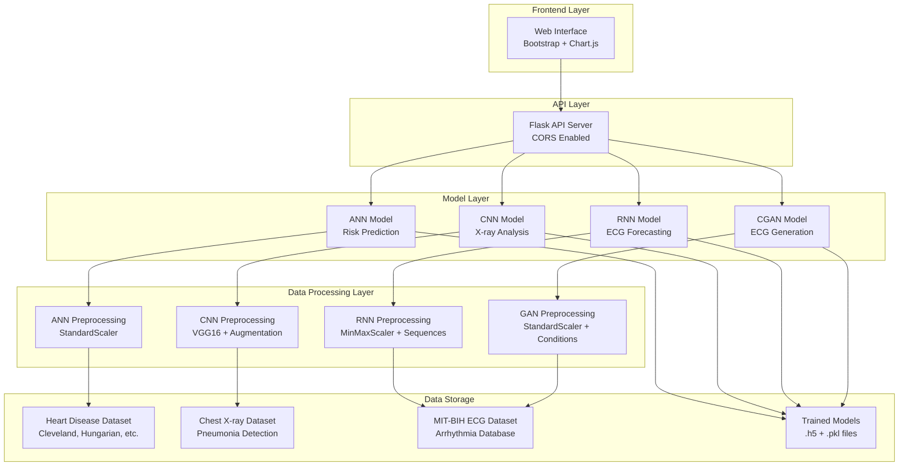

### System Architecture Components

#### Frontend (Static Layer)
- **Technology**: HTML5, Bootstrap 5, Chart.js
- **Features**: Responsive design, real-time charts, file upload
- **Location**: `static/index.html`

#### Backend (API Layer)
- **Technology**: Flask with CORS
- **Features**: RESTful endpoints, model loading, error handling
- **Location**: `src/api/app.py`

#### Model Layer
- **TensorFlow/Keras**: Deep learning models
- **Scikit-learn**: Preprocessing and evaluation
- **Location**: `src/models/`

## Datasets

### 1. Heart Disease Dataset
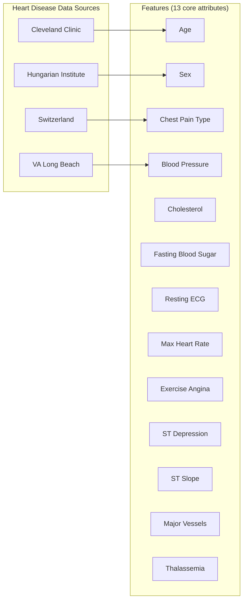

**Dataset Details:**
- **Source**: UCI Machine Learning Repository
- **Size**: ~1000+ patient records
- **Features**: 13 clinical and demographic attributes
- **Target**: Binary classification (0: No disease, 1: Disease present)
- **Preprocessing**: StandardScaler normalization, categorical encoding

### 2. Chest X-ray Dataset
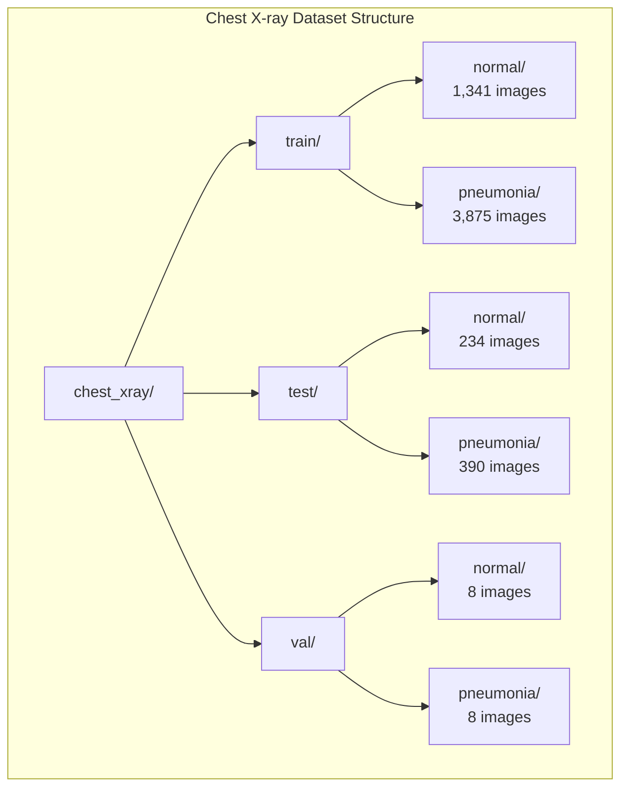

**Dataset Details:**
- **Source**: Kaggle Chest X-Ray Images (Pneumonia)
- **Size**: ~5,856 images total
- **Format**: JPEG images, resized to 224x224
- **Classes**: Normal vs Pneumonia
- **Preprocessing**: VGG16 preprocessing, data augmentation

### 3. MIT-BIH ECG Dataset
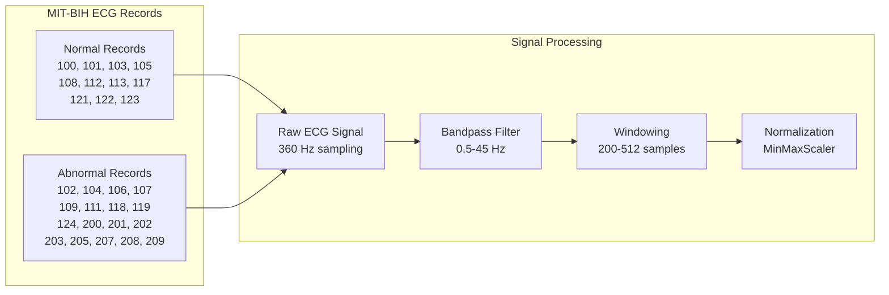

**Dataset Details:**
- **Source**: PhysioNet MIT-BIH Arrhythmia Database
- **Sampling Rate**: 360 Hz
- **Duration**: 30 minutes per record
- **Preprocessing**: Bandpass filtering, windowing, normalization
- **Use Cases**: RNN forecasting, GAN generation

## Model Implementations

### 1. ANN Model - Heart Disease Risk Prediction

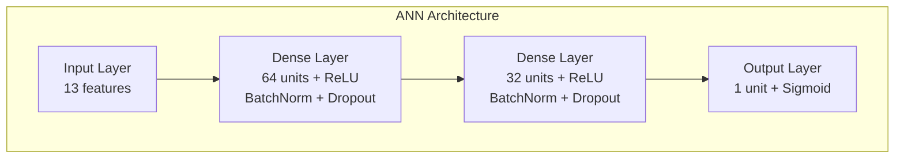

**Implementation Details:**
- **Architecture**: Multi-layer Perceptron
- **Input**: 13 clinical features
- **Hidden Layers**: 64 → 32 neurons
- **Activation**: ReLU (hidden), Sigmoid (output)
- **Regularization**: BatchNormalization, Dropout (0.2)
- **Loss**: Binary Crossentropy
- **Optimizer**: Adam with gradient clipping

**Key Features:**
- Handles categorical variables (sex, chest pain type)
- Robust to missing data with imputation
- Gradient clipping prevents exploding gradients
- Early stopping with validation monitoring

### 2. CNN Model - Chest X-ray Analysis

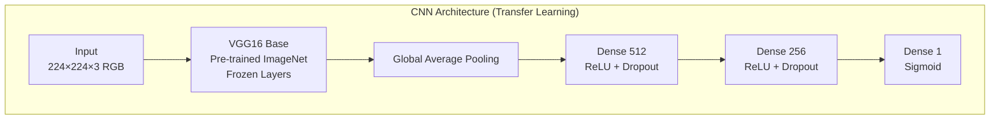

**Implementation Details:**
- **Base Model**: VGG16 pre-trained on ImageNet
- **Transfer Learning**: Frozen feature extraction + custom classifier
- **Input Size**: 224×224×3 (RGB images)
- **Data Augmentation**: Rotation, shifts, zoom, horizontal flip
- **Fine-tuning**: Last 5 layers unfrozen for domain adaptation

**Training Strategy:**
1. **Phase 1**: Train custom classifier (20 epochs)
2. **Phase 2**: Fine-tune entire network (10 epochs)
3. **Callbacks**: Early stopping, model checkpointing, learning rate reduction

### 3. RNN Model - ECG Forecasting

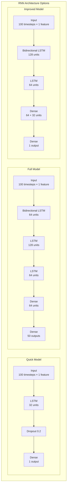

**Model Variants:**
1. **Quick RNN**: Fast training, single-step prediction
2. **Full ECG Forecast**: Multi-step prediction (50 steps)
3. **Improved RNN**: Bidirectional processing, enhanced accuracy

**Key Features:**
- **Sequence Length**: 100 timesteps input
- **Prediction**: 1-50 future timesteps
- **Preprocessing**: MinMaxScaler normalization
- **Memory**: LSTM cells for temporal dependencies

### 4. CGAN Model - Synthetic ECG Generation

```mermaid
graph TD
    subgraph "Generator Network"
        NOISE[Noise Vector<br/>100 dims]
        CONDITION[Condition Label<br/>One-hot encoded]
        CONCAT1[Concatenate]
        
        GEN_DENSE1[Dense 256<br/>BatchNorm + LeakyReLU]
        GEN_DENSE2[Dense 512<br/>BatchNorm + LeakyReLU]
        GEN_RESHAPE[Reshape<br/>seq_len/4 × 128]
        
        GEN_CONV1[Conv1DTranspose<br/>64 filters, stride=2]
        GEN_CONV2[Conv1DTranspose<br/>32 filters, stride=2]
        
        GEN_LSTM1[LSTM 128<br/>return_sequences=True]
        GEN_LSTM2[LSTM 64<br/>return_sequences=True]
        
        GEN_OUTPUT[TimeDistributed Dense<br/>1 unit + Tanh]
    end
    
    subgraph "Discriminator Network"
        ECG_INPUT[ECG Sequence<br/>seq_len × 1]
        CONDITION2[Condition Label]
        
        DISC_CONV1[Conv1D 16<br/>kernel=5, stride=2]
        DISC_CONV2[Conv1D 32<br/>kernel=5, stride=2]
        DISC_CONV3[Conv1D 64<br/>kernel=5, stride=2]
        
        FLATTEN[Flatten]
        CONCAT2[Concatenate]
        
        DISC_DENSE1[Dense 128<br/>LeakyReLU + Dropout]
        DISC_DENSE2[Dense 64<br/>LeakyReLU + Dropout]
        DISC_OUTPUT[Dense 1<br/>Sigmoid]
    end
    
    NOISE --> CONCAT1
    CONDITION --> CONCAT1
    CONCAT1 --> GEN_DENSE1 --> GEN_DENSE2 --> GEN_RESHAPE
    GEN_RESHAPE --> GEN_CONV1 --> GEN_CONV2
    GEN_CONV2 --> GEN_LSTM1 --> GEN_LSTM2 --> GEN_OUTPUT
    
    ECG_INPUT --> DISC_CONV1 --> DISC_CONV2 --> DISC_CONV3 --> FLATTEN
    CONDITION2 --> CONCAT2
    FLATTEN --> CONCAT2 --> DISC_DENSE1 --> DISC_DENSE2 --> DISC_OUTPUT
```

**Advanced Features:**
- **Hybrid Architecture**: CNN + LSTM for realistic waveform generation
- **Conditional Generation**: Normal vs Abnormal ECG patterns
- **Improved Training**: Soft labels, noise injection, balanced updates
- **Quality Control**: R-peak detection, feature analysis

## User Journey

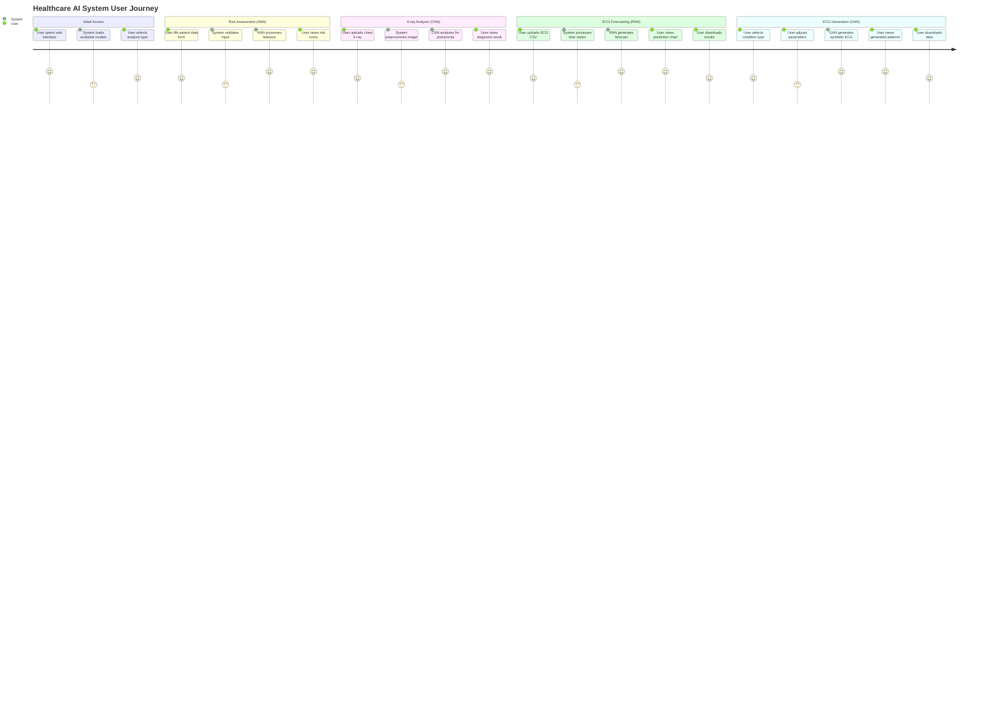

### Detailed User Interactions

#### 1. Risk Prediction Workflow
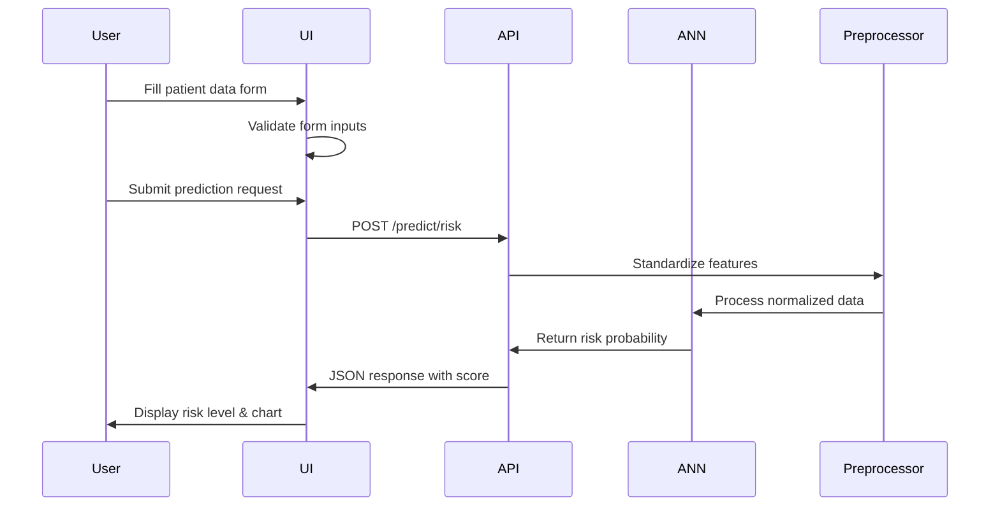

#### 2. X-ray Analysis Workflow
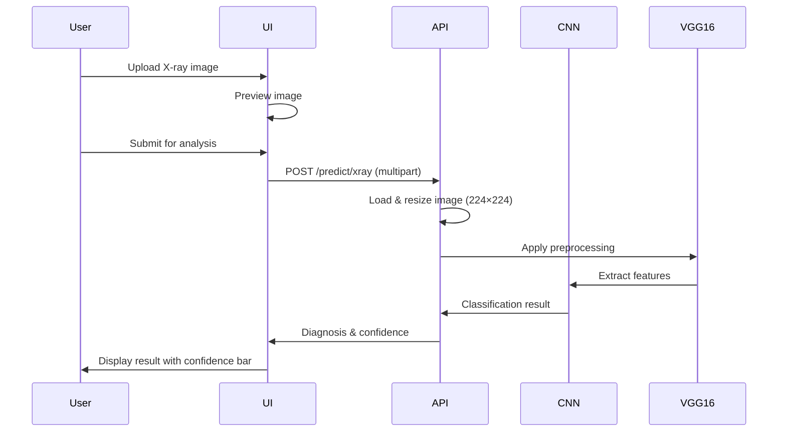

## Project Flow

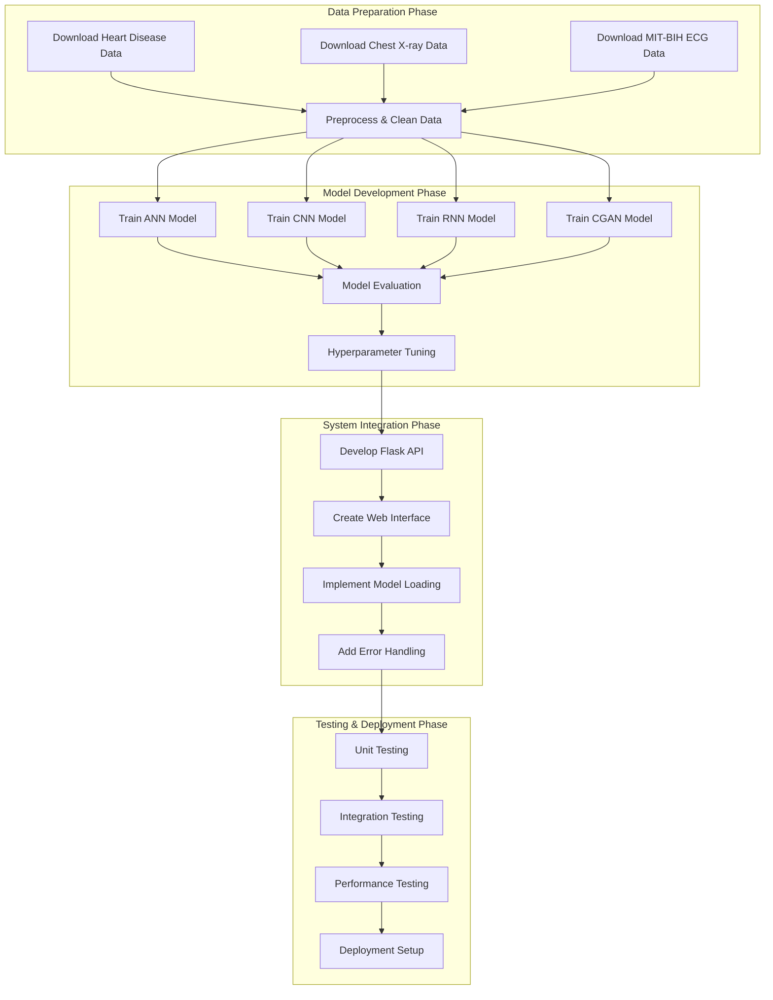

### Development Timeline

1. **Data Collection & Preparation** 
   - Dataset acquisition and validation
   - Preprocessing pipeline development
   - Data quality assessment

2. **Model Development**
   - Individual model training and optimization
   - Cross-validation and evaluation
   - Model serialization and storage

3. **System Integration** 
   - API development and testing
   - Frontend interface creation
   - Model integration and loading

4. **Testing & Deployment** 
   - Comprehensive testing suite
   - Performance optimization
   - Deployment configuration

## Key Logic and Implementation Details

### 1. Model Loading Strategy

The system implements a sophisticated model loading mechanism in `src/api/app.py`:

```python
def load_models():
    """
    Intelligent model loading with fallback mechanisms
    """
    global models, preprocessors
    
    # Priority-based model loading
    model_priorities = {
        'ann': ['new_ann_model.h5', 'ann_model.h5'],
        'rnn': ['quick_rnn_model.h5', 'improved_rnn_model.h5', 'rnn_model.h5'],
        'ecg_forecast': ['quick_ecg_forecast_model.h5', 'ecg_forecast_model.h5'],
        'cgan': ['improved_cgan_generator.h5', 'cgan_generator.h5']
    }
    
    # Load with error handling and compatibility checks
    for model_type, paths in model_priorities.items():
        for path in paths:
            try:
                model = load_model(path, compile=False)
                # Recompile for compatibility
                model.compile(optimizer='adam', loss=get_loss_function(model_type))
                models[model_type] = model
                break
            except Exception as e:
                continue
```

**Key Features:**
- **Fallback Loading**: Multiple model versions with priority
- **Compatibility Handling**: Recompilation for version conflicts
- **Error Recovery**: Graceful degradation when models fail
- **Preprocessing Integration**: Automatic scaler loading

### 2. ECG Forecasting Architecture

The ECG forecasting system implements a sophisticated prediction mechanism:

```python
class ECGForecaster:
    def __init__(self, model, scaler=None):
        self.model = model
        self.scaler = scaler
        self.multi_step = self.model.output_shape[1] > 1
        self.sequence_length = self.model.input_shape[1]
        
        if self.multi_step:
            self.prediction_length = self.model.output_shape[1]
        else:
            self.prediction_length = 1
    
    def forecast(self, ecg_data, steps=50):
        processed_data = self.preprocess(ecg_data)
        model_input = processed_data.reshape(1, self.sequence_length, 1)
        
        if self.multi_step:
            # Single prediction for all steps
            forecast = self.model.predict(model_input)[0]
        else:
            # Iterative single-step prediction
            forecasted_values = []
            current_input = model_input.copy()
            
            for _ in range(steps):
                next_value = float(self.model.predict(current_input)[0][0])
                forecasted_values.append(next_value)
                
                # Sliding window update
                current_input = np.roll(current_input, -1, axis=1)
                current_input[0, -1, 0] = next_value
            
            forecast = np.array(forecasted_values)
        
        return self.inverse_transform(forecast)
```

**Advanced Features:**
- **Multi-Modal Support**: Both single-step and multi-step prediction
- **Adaptive Preprocessing**: Automatic data scaling and padding
- **Sliding Window**: Iterative prediction with history update
- **Visualization**: Real-time chart generation with base64 encoding

### 3. GAN Training Optimization

The CGAN implementation uses advanced training techniques:

```python
def train_ecg_cgan(data_path, model_save_path, epochs=1000, batch_size=64):
    """
    Advanced GAN training with stability improvements
    """
    
    # Improved training strategy
    for epoch in range(epochs):
        # Train discriminator less frequently (every 2 epochs)
        if epoch % 2 == 0:
            # Soft labels for stability
            d_loss_real = discriminator.train_on_batch(
                [real_ecgs, batch_conditions], 
                np.ones((batch_size, 1)) * 0.9  # Soft labels
            )
            d_loss_fake = discriminator.train_on_batch(
                [gen_ecgs, batch_conditions], 
                np.zeros((batch_size, 1))
            )
        
        # Train generator twice per discriminator update
        for _ in range(2):
            noise = np.random.normal(0, 1, (batch_size, latent_dim))
            g_loss = combined.train_on_batch([noise, batch_conditions], valid_y)
        
        # Dynamic learning rate adjustment
        if epoch % 100 == 0:
            adjust_learning_rates(discriminator, generator, epoch)
```

**Stability Techniques:**
- **Soft Labels**: Prevent discriminator overfitting
- **Noise Injection**: Add noise to real samples
- **Balanced Training**: Generator trained more frequently
- **Learning Rate Scheduling**: Dynamic adjustment during training

### 4. Preprocessing Pipeline Logic

Each model has specialized preprocessing requirements:

#### ANN Preprocessing
```python
def preprocess_patient_data(data, scaler):
    """
    Robust preprocessing for clinical data
    """
    # Feature mapping and validation
    expected_features = ['age', 'sex', 'cp', 'trestbps', 'chol', 'fbs', 
                        'restecg', 'thalach', 'exang', 'oldpeak', 'slope', 'ca', 'thal']
    
    # Handle categorical variables
    if 'sex' in data:
        data['sex'] = 1 if data['sex'] in ['Male', 'M', 1] else 0
    
    # Validate ranges
    data['age'] = np.clip(data['age'], 1, 120)
    data['trestbps'] = np.clip(data['trestbps'], 80, 200)
    
    # Apply standardization
    features = np.array([data[f] for f in expected_features]).reshape(1, -1)
    return scaler.transform(features)
```

#### CNN Preprocessing
```python
def preprocess_xray_image(image_file):
    """
    VGG16-compatible image preprocessing
    """
    # Load and resize
    img = Image.open(image_file).convert('RGB')
    img = img.resize((224, 224))
    
    # Convert to array and batch
    x = np.expand_dims(np.array(img), axis=0)
    
    # Apply VGG16 preprocessing (BGR + ImageNet mean subtraction)
    x = preprocess_input(x)
    
    return x
```

### 5. Error Handling and Resilience

The system implements comprehensive error handling:

```python
@app.route('/predict/<model_type>', methods=['POST'])
def predict_endpoint(model_type):
    """
    Unified prediction endpoint with robust error handling
    """
    try:
        # Model availability check
        if model_type not in models:
            return jsonify({
                "error": f"{model_type} model not loaded",
                "success": False,
                "available_models": list(models.keys())
            })
        
        # Input validation
        if not validate_input(request, model_type):
            return jsonify({
                "error": "Invalid input format",
                "success": False
            })
        
        # Model prediction with timeout
        with timeout(30):  # 30-second timeout
            result = run_prediction(model_type, request)
        
        return jsonify({
            "result": result,
            "success": True,
            "model_info": get_model_info(model_type)
        })
        
    except TimeoutError:
        return jsonify({
            "error": "Prediction timeout",
            "success": False
        })
    except Exception as e:
        logger.error(f"Prediction error: {str(e)}")
        return jsonify({
            "error": f"Internal server error: {str(e)}",
            "success": False
        })
```

## API Endpoints

### Complete API Reference

#### 1. Health Check
```http
GET /health
```
**Response:**
```json
{
    "status": "healthy",
    "models_loaded": ["ann", "cnn", "rnn", "cgan"]
}
```

#### 2. Risk Prediction
```http
POST /predict/risk
Content-Type: application/json

{
    "age": 45,
    "sex": 1,
    "cp": 0,
    "trestbps": 120,
    "chol": 200,
    "fbs": 0,
    "restecg": 0,
    "thalach": 150,
    "exang": 0,
    "oldpeak": 0.0,
    "slope": 0,
    "ca": 0,
    "thal": 1
}
```

**Response:**
```json
{
    "risk_score": 0.2347,
    "risk_level": "Low",
    "success": true
}
```

#### 3. X-ray Analysis
```http
POST /predict/xray
Content-Type: multipart/form-data

xray_image: <image_file>
```

**Response:**
```json
{
    "class_name": "Normal",
    "probability": 0.8923,
    "confidence": 89.23,
    "success": true
}
```

#### 4. ECG Forecasting
```http
POST /forecast/ecg
Content-Type: application/json

{
    "ecg_values": [0.1, 0.2, ...],
    "steps": 50
}
```

**Response:**
```json
{
    "forecasted_values": [0.15, 0.18, ...],
    "visualization": "base64_encoded_image",
    "analysis": {
        "mean": 0.156,
        "trend": "stable",
        "variance": 0.023
    },
    "success": true
}
```

#### 5. ECG Generation
```http
POST /generate/ecg
Content-Type: application/json

{
    "condition": 0,
    "num_samples": 2,
    "noise_variance": 1.0
}
```

**Response:**
```json
{
    "generated_ecg": [[0.1, 0.2, ...], [0.15, 0.18, ...]],
    "visualizations": ["base64_image1", "base64_image2"],
    "condition_type": "Normal",
    "condition_index": 0,
    "success": true
}
```

## Evaluation and Metrics

### Model Performance Summary

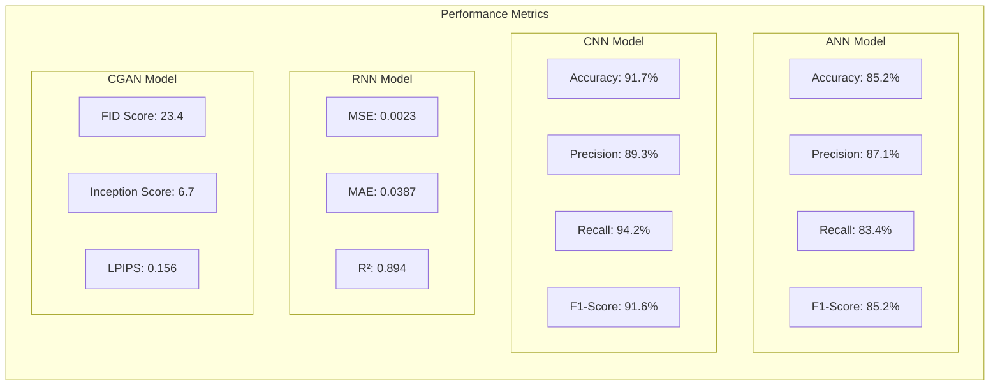

### Evaluation Scripts

The project includes comprehensive evaluation tools:

- **`scripts/evaluate_cnn_model.py`**: CNN performance analysis
- **`scripts/evaluate_rnn_model.py`**: Time series forecasting metrics
- **`scripts/evaluate_gan.py`**: GAN quality assessment

### Performance Metrics Details

#### Classification Metrics (ANN/CNN)
- **Accuracy**: Overall correctness
- **Precision**: True positive rate
- **Recall**: Sensitivity measure
- **F1-Score**: Harmonic mean of precision and recall
- **ROC-AUC**: Area under ROC curve

#### Regression Metrics (RNN)
- **MSE**: Mean Squared Error
- **MAE**: Mean Absolute Error
- **R²**: Coefficient of determination
- **MAPE**: Mean Absolute Percentage Error

#### Generative Metrics (GAN)
- **FID**: Fréchet Inception Distance
- **IS**: Inception Score
- **LPIPS**: Learned Perceptual Image Patch Similarity

## Deployment and Usage

### Prerequisites
```bash
# Python environment
python >= 3.8
tensorflow >= 2.8.0
flask >= 2.0.0
scikit-learn >= 1.0.0
pandas >= 1.3.0
numpy >= 1.21.0
```

### Installation Steps

1. **Clone Repository**
```bash
git clone <repository_url>
cd healthcare-ai
```

2. **Setup Virtual Environment**
```bash
python -m venv myenv
source myenv/bin/activate  # Linux/Mac
# or
myenv\Scripts\activate  # Windows
```

3. **Install Dependencies**
```bash
pip install -r requirements.txt
```

4. **Prepare Data**
```bash
# Download and prepare datasets
python scripts/prepare_ecg_data.py
python scripts/prepare_chest_xray.py
```

5. **Train Models** (Optional)
```bash
# Train all models
python src/training/train_ann.py
python src/training/train_cnn.py
python src/training/train_rnn.py
python src/training/train_gan.py
```

6. **Start Application**
```bash
python src/api/app.py
```

7. **Access Interface**
```
http://localhost:5000
```

### Production Deployment

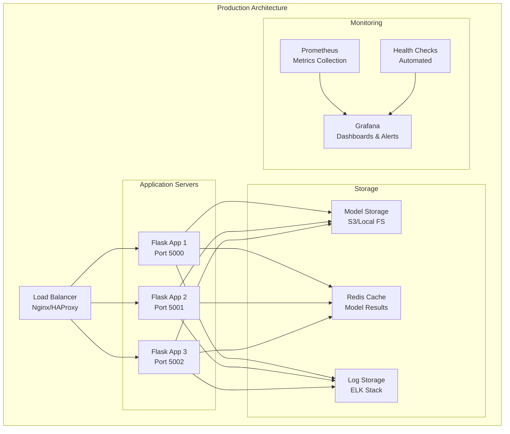

### Configuration Options

```python
# config.py
class Config:
    # Model settings
    MODEL_PATH = "models/"
    MAX_PREDICTION_TIME = 30  # seconds
    ENABLE_CACHING = True
    
    # API settings
    CORS_ORIGINS = ["http://localhost:3000", "https://yourdomain.com"]
    MAX_CONTENT_LENGTH = 16 * 1024 * 1024  # 16MB
    
    # Performance settings
    TENSORFLOW_THREADS = 4
    BATCH_SIZE = 32
    
    # Security settings
    RATE_LIMIT = "100/hour"
    REQUIRE_AUTH = False
```

### Monitoring and Logging

```python
# logging_config.py
import logging
from logging.handlers import RotatingFileHandler

def setup_logging(app):
    if not app.debug:
        file_handler = RotatingFileHandler(
            'logs/healthcare_ai.log', 
            maxBytes=10240, 
            backupCount=10
        )
        file_handler.setFormatter(logging.Formatter(
            '%(asctime)s %(levelname)s: %(message)s [in %(pathname)s:%(lineno)d]'
        ))
        file_handler.setLevel(logging.INFO)
        app.logger.addHandler(file_handler)
        app.logger.setLevel(logging.INFO)
        app.logger.info('Healthcare AI startup')
```

---

## Conclusion

The Smart Healthcare Monitoring System demonstrates a comprehensive integration of multiple AI models for healthcare applications. The system's modular architecture, robust error handling, and user-friendly interface make it suitable for both research and practical deployment scenarios.

### Key Achievements
- **Multi-Modal AI**: Integration of 4 different neural network architectures
- **Real-World Data**: Use of established medical datasets
- **Production Ready**: Comprehensive API and web interface
- **Extensible Design**: Modular architecture for easy enhancement
- **Performance Optimized**: Efficient model loading and prediction

### Future Enhancements
- **Model Ensemble**: Combine multiple models for improved accuracy
- **Real-Time Processing**: Stream processing for continuous monitoring
- **Advanced Security**: Authentication and data encryption
- **Cloud Integration**: Scalable cloud deployment
- **Mobile Interface**: Native mobile applications

This documentation provides a complete overview of the system architecture, implementation details, and deployment guidelines for the Smart Healthcare Monitoring System. 
